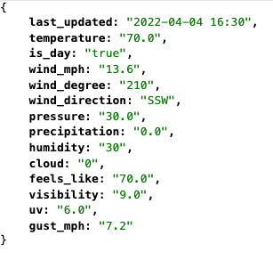

# Developer Coding Challenge

## Requirements:
1. Build a persistent file caching mechanism which implements the interface CacheInterface from this repository
2. Write a service that connects to a fictional weather application’s api. The service
   should retrieve the data from the fictional weather api using the three following
   criteria:
    1. The url: www.fakeweather.com/api/v1/?postal_code={zip code}
    2. The API key : ba8e0c9c-20e8-4b54:c06fc8f9-fbba-4e9c-807cc8bdd0c54687
    3. The API key must be base64 encoded and added to the authorization
       header.
3. The response body for the fictional weather api will have the following structure:

| Field          | Type        | Description |
| -------------  | ----------- | -------------------------------------------------| 
| last_updated   | string	     | Local time when the real time data was updated.  |
| temperature  	 | decimal	   | Temperature in fahrenheit.                       |
| feels_like 	   | decimal	   | Feels like temperature in fahrenheit.            |
| wind_mph	     | decimal	   | Wind speed in miles per hour.                    |
| wind_degree	   | int	       | Wind direction in degrees.|
| wind_direction | string	     | Wind direction as 16 point compass. e.g.: NSW. |
| pressure  	   | decimal	   | Pressure in inches. |
| precipitation	 | decimal	   | Precipitation amount in inches. |
| humidity	     | int	       | Humidity as percentage. |
| cloud 	       | int	       | Cloud cover as percentage.|
| is_day	       | boolean     | Whether or not it is currently daytime.|
| uv	           | decimal	   | UV Index.|
| gust_mph	     | decimal	   | Wind gust in miles per hour.|
| visibility     | decimal     | Visibility in miles. |

```
 "data": {
        "last_updated": "2022-04-04 16:30",
        "temperature": 70.0,
        "is_day": true,
        "wind_mph": 13.6,
        "wind_degree": 210,
        "wind_direction": "SSW",
        "pressure": 30.0,
        "precipitation": 0.0,
        "humidity": 30,
        "cloud": 0,
        "feels_like": 70.0,
        "visibility": 9.0,
        "uv": 6.0,
        "gust_mph": 7.2
    }
```

4. The service should cache the api results for 5 minutes.
5. Write an object object that is capable of returning the cached result or results from
   the service object if the cache is expired.
6. You may not use any packages or frameworks expect for PHPUnit.

## Solution:
### 1. Clone this git directory

  - In your terminal, navigate to the directory you want to clone this repository and clone the repo using Git CLI:
```
gh repo clone rdbindia/Walk2Campus
```
If you are setting up using SSH key:
```
git@github.com:rdbindia/Walk2Campus.git
```

Once the cloning is done, navigate to the newly created directory.

### 2. Set up your .env file
From the root dirctory copy the .env.example to .env

```
cp .env.example .env
```

Add the required keys for the API to run.

### 3 Build Docker Containers and run composer

Build Docker containers using:
```
docker compose up --build

composer install
```

### Verify Installation.

## Screenshots

- On error (As this is a fake API)


- On success


